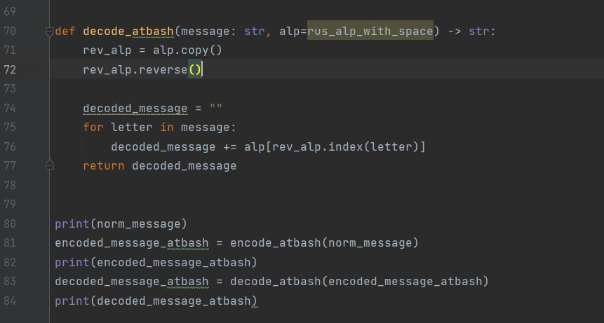
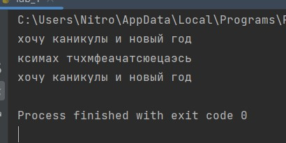

---
# Front matter
title: "Лабораторная работа 1"
author: "Серенко Данил Сергеевич, НФИмд-01-23"

# Generic otions
lang: ru-RU
toc-title: "Содержание"

# Bibliography
bibliography: bib/cite.bib
csl: pandoc/csl/gost-r-7-0-5-2008-numeric.csl

# Pdf output format
toc: true # Table of contents
toc_depth: 2
lof: true # List of figures
lot: true # List of tables
fontsize: 12pt
linestretch: 1.5
papersize: a4
documentclass: scrreprt
## I18n
polyglossia-lang:
  name: russian
  options:
	- spelling=modern
	- babelshorthands=true
polyglossia-otherlangs:
  name: english
### Fonts
mainfont: PT Serif
romanfont: PT Serif
sansfont: PT Sans
monofont: PT Mono
mainfontoptions: Ligatures=TeX
romanfontoptions: Ligatures=TeX
sansfontoptions: Ligatures=TeX,Scale=MatchLowercase
monofontoptions: Scale=MatchLowercase,Scale=0.9
## Biblatex
biblatex: true
biblio-style: "gost-numeric"
biblatexoptions:
  - parentracker=true
  - backend=biber
  - hyperref=auto
  - language=auto
  - autolang=other*
  - citestyle=gost-numeric
## Misc options
indent: true
header-includes:
  - \linepenalty=10 # the penalty added to the badness of each line within a paragraph (no associated penalty node) Increasing the value makes tex try to have fewer lines in the paragraph.
  - \interlinepenalty=0 # value of the penalty (node) added after each line of a paragraph.
  - \hyphenpenalty=50 # the penalty for line breaking at an automatically inserted hyphen
  - \exhyphenpenalty=50 # the penalty for line breaking at an explicit hyphen
  - \binoppenalty=700 # the penalty for breaking a line at a binary operator
  - \relpenalty=500 # the penalty for breaking a line at a relation
  - \clubpenalty=150 # extra penalty for breaking after first line of a paragraph
  - \widowpenalty=150 # extra penalty for breaking before last line of a paragraph
  - \displaywidowpenalty=50 # extra penalty for breaking before last line before a display math
  - \brokenpenalty=100 # extra penalty for page breaking after a hyphenated line
  - \predisplaypenalty=10000 # penalty for breaking before a display
  - \postdisplaypenalty=0 # penalty for breaking after a display
  - \floatingpenalty = 20000 # penalty for splitting an insertion (can only be split footnote in standard LaTeX)
  - \raggedbottom # or \flushbottom
  - \usepackage{float} # keep figures where there are in the text
  - \floatplacement{figure}{H} # keep figures where there are in the text
---

<h1 align="center">

РОССИЙСКИЙ УНИВЕРСИТЕТ ДРУЖБЫ НАРОДОВ 

Факультет физико-математических и естественных наук  

Кафедра математического моделирования и искусственного интеллекта

ОТЧЕТ ПО ЛАБОРАТОРНОЙ РАБОТЕ №1
  
<h2 align="right">

дисциплина: Математические основы защиты информации и информационной безопасности

Преподователь: Кулябов Дмитрий Сергеевич

Студент: Серенко Данил Сергеевич

Группа: НФИмд-01-23
  
  
<h1 align="center">

МОСКВА

2023 г.
</h1>

# Цель работы

Целью данной работы является приобретение практических навыков шифрования простой замены.[1]

# Выполнение лабораторной работы

Требуется реализовать шифр Цезаря с произвольным ключом k и Реализовать шифр Атбаш.

Для этого я реализовал две программы на языке Python

Первая программа для шифра Цезаря(@fig:001)(@fig:002).

{#fig:001 width=100%}

{#fig:002 width=100%}

Затем я запустил программу, ввел пароль и сдвиг. Получил таблицу шифрования. Затем ввел предложение, которое нужно закодировать и получил зашифрованное сообщение.
Вывод работы программы (@fig:003)

{#fig:003 width=100%}

Вторая программа для шифра Атбаш(@fig:004).

{#fig:004 width=100%}
{#fig:004 width=100%}

Вывод работы программы (@fig:005)

{#fig:005 width=100%}

# Выводы

В результате выполнения работы я освоил на практике шифрование простой замены. Шифр Цезаря и Атбаш.

# Список литературы

1. Методические материалы курса
